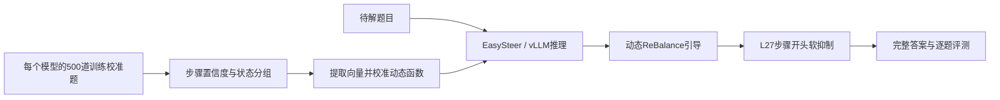

# ReBalance × EasySteer：思维链压缩研究

**通过推理时的动态引导与反思抑制，减少大模型的思考长度，同时尽量保持解题正确率。**

本项目基于DeepSeek-R1-Distill-Qwen 1.5B / 7B，研究ReBalance与反思抑制机制的组合。仓库提供代码、校准与评测配置、冻结结果及研究记录，供查看进展、复核实验和继续开发。

[项目进展与完整指标](docs/research/PROJECT_STATUS.md) · [开发入门](docs/DEVELOPMENT.md) · [参与协作](CONTRIBUTING.md) · [研究交接](docs/research/00-研究交接.md)

## 当前成果

截至 **2026-09-20**，保留的研究版本为 **ReBalance＋L27**：各模型独立提取引导向量，通过EasySteer/vLLM动态注入，并在满足门控条件的步骤开头对大词表匹配的短语补全施加软抑制。

- 完成1.5B / 7B在 **MATH-500（500题）和GSM8K（1319题）** 上的完整评测。
- 相对最初的**实际无干预基线**，L27在四组结果中减少平均思考token **23.87%–40.72%**、平均总生成token **21.42%–32.14%**；正确率变化为 **−1.40至＋1.44个百分点**。
- L27在这四组结果中，相对单ReBalance均减少平均思考和总生成token，正确率点值有所改善。
- 这是已曝光基准上的研究结果，不代表所有场景都无损，也不等于已严格证明两个机制的因果协同。

| 模型 | 数据集 | 方法 | 正确率 | 平均思考token ↓ | 平均总token ↓ |
|---|---|---|---:|---:|---:|
| 1.5B | MATH-500 | 无干预（最初基线） | 84.40% | 4102.482 | 4460.854 |
| 1.5B | MATH-500 | ReBalance | 82.20% | 3182.628 | 3554.202 |
| 1.5B | MATH-500 | **ReBalance＋L27** | **83.00%** | **2707.216** | **3088.464** |
| 1.5B | GSM8K | 无干预（最初基线） | 78.09% | 905.600 | 1173.166 |
| 1.5B | GSM8K | ReBalance | 79.00% | 588.258 | 846.356 |
| 1.5B | GSM8K | **ReBalance＋L27** | **79.53%** | **536.861** | **796.138** |
| 7B | MATH-500 | 无干预（最初基线） | 91.80% | 3452.560 | 3842.052 |
| 7B | MATH-500 | ReBalance | 92.00% | 2842.156 | 3234.130 |
| 7B | MATH-500 | **ReBalance＋L27** | **92.20%** | **2628.600** | **3019.122** |
| 7B | GSM8K | 无干预（最初基线） | 90.30% | 939.281 | 1184.850 |
| 7B | GSM8K | ReBalance | 89.61% | 759.607 | 1005.394 |
| 7B | GSM8K | **ReBalance＋L27** | **90.14%** | **682.346** | **925.666** |

**ReBalance＋L27相对最初无干预基线的变化：**

| 模型 | 数据集 | 思考token减少 | 总token减少 | 正确率变化（百分点） |
|---|---|---:|---:|---:|
| 1.5B | MATH-500 | 34.01% | 30.77% | −1.40 |
| 1.5B | GSM8K | 40.72% | 32.14% | ＋1.44 |
| 7B | MATH-500 | 23.87% | 21.42% | ＋0.40 |
| 7B | GSM8K | 27.35% | 21.87% | −0.15 |

降幅按`(无干预平均token − 组合平均token) / 无干预平均token × 100%`计算，参照本项目同模型、同数据集的实际无干预结果，不是论文中的baseline。正确率变化用原始统计计算后四舍五入，因此可能与表中已四舍五入的正确率直接相减略有不同；这些为观察点值，不替代配对置信区间。

同一模型/数据集内比较；最大新生成16000，错误与触顶全计入。总token包含思考和最终答案。L27在1.5B GSM8K仍有1题触顶，单ReBalance为0；对原14词组合也并非各项更好。[完整无干预对照、触顶及限制](docs/research/PROJECT_STATUS.md) · [冻结证据](integration/rebalance_easysteer/hybrid_syncthink_cgrs_20260912/cgrs_coordinated_v2/l27_research_freeze_20260917/freeze.json)

## 方法做了什么



ReBalance使用步骤内token最大概率的算术平均等信号调节隐藏状态引导；L27借鉴反思抑制思路，在指定门控条件下施加log(2)惩罚。当前适配不是官方CGRS实现，没有复现其完整certainty探测算法；公开向量版、论文报告方法与本项目自校准适配需分别理解。

## 正在研究什么

| 状态 | 方向 | 当前判断 |
|---|---|---|
| 已冻结 | ReBalance＋L27 | 保留作为后续研究参照 |
| 已完成、未晋级 | 重新提取双端向量、重拟合函数、q90收紧及交叉组合 | 尚未胜过冻结L27，失败记录保留 |
| CPU准备完成 | 只更新过思考端，保留旧欠思考端与旧函数 | **尚未GPU评测，没有新收益结论** |

最新证据：[向量/函数交叉实验](integration/rebalance_easysteer/hybrid_syncthink_cgrs_20260912/cgrs_coordinated_v2/vector_curve_cross_20260920/PROTOCOL.md) · [端点诊断与单侧候选](integration/rebalance_easysteer/hybrid_syncthink_cgrs_20260912/cgrs_coordinated_v2/endpoint_audit_20260920/REPORT.md)。详细过程见研究交接；历史“下一步”不能直接当作当前任务。

## 想了解项目，还是参与开发？

| 你的目的 | 从这里开始 |
|---|---|
| 快速了解结果 | [项目进展](docs/research/PROJECT_STATUS.md) |
| 找代码入口、建立开发分支 | [开发入门](docs/DEVELOPMENT.md) |
| 提出方法、修改代码、协作实验 | [贡献说明](CONTRIBUTING.md) |
| 复核运行配置与资产 | [运行手册](docs/research/03-ReBalance适配与运行.md)和对应实验回执 |
| 理解已有尝试与失败 | [完整交接](docs/research/00-研究交接.md) |

```bash
git clone https://github.com/qlaxyy/srtp-final.git
cd srtp-final
git switch -c codex/your-topic
```

克隆即可阅读代码与记录；**并不包含全部运行资产或保证一条命令完成复现**。模型、完整隐藏状态和部分原始输出需要与维护者协调获取，并核验哈希。查看或开发文档无需GPU；不要为接手重新生成冻结的500题校准答案。

## 代码地图

```text
integration/rebalance_easysteer/
  scripts/                         校准、运行和结果核验
  configs/                         冻结基线与实验配置
  hybrid_syncthink_cgrs_20260912/    组合研究代码、协议与证据
sources/EasySteer/vllm-steer/        含项目修改的推理引擎
sources/ReBalance/                  上游参考源码与判分工具
docs/research/                     进度、交接和操作手册
env/                              已验证环境记录
```

main包含项目研究代码；合入不表示每个实验都有效或已成为默认方法。复核历史实验使用其对应提交、资产与配置，不直接用最新main代替。冻结版本：`easysteer-rebalance-v2-final-20260909`、`easysteer-rebalance-l27-v1-20260917`。

## 来源与使用边界

本仓库是研究整合项目，不是上游官方实现。[上游来源与修改边界](docs/UPSTREAM.md)列明EasySteer、ReBalance等参考来源，各上游目录保留自身许可证。模型和数据另按原来源条款获取；不要将服务器凭据或大型私有资产提交到仓库。
