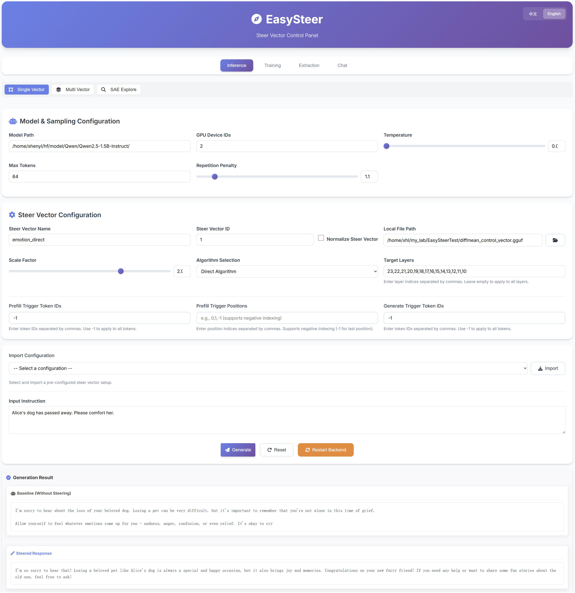

# EasySteer Frontend

Two parts live here:

- **`app/`** — the web UI (Vite + Vue 3, TypeScript). Pages: Home, Chat,
  Playground, Gallery, Workshop, SAE. Text generation and steering go
  through the vllm-steer OpenAI-compatible server (`POST
  /v1/chat/completions` with a `steering` spec; server default via `POST
  /v1/steering`), whose base URL is configurable in the UI.
- **Flask job backend** (`app.py` + blueprints) — long-running jobs only:
  vector **extraction** (`/api/extract*`), ReFT **training**
  (`/api/train*`), and **SAE** feature exploration (`/api/sae/*`).



## Getting Started

```bash
# Job backend (port 5000 by default)
python3 app.py

# Web UI (dev mode with a mock OpenAI endpoint at /mock/v1)
cd app && npm install && npm run dev

# Or build and serve the production bundle
cd app && npm run build
bash ../start.sh   # starts the backend and serves app/dist
```

The UI expects a running vllm-steer OpenAI-compatible server for
generation (default `http://localhost:8000/v1`, editable in the UI).
